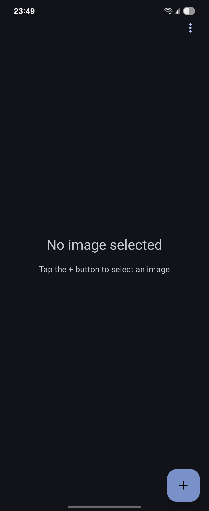
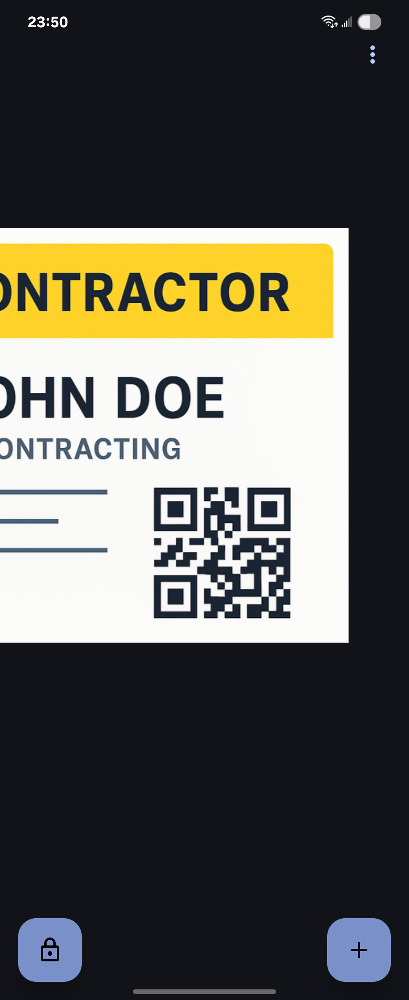
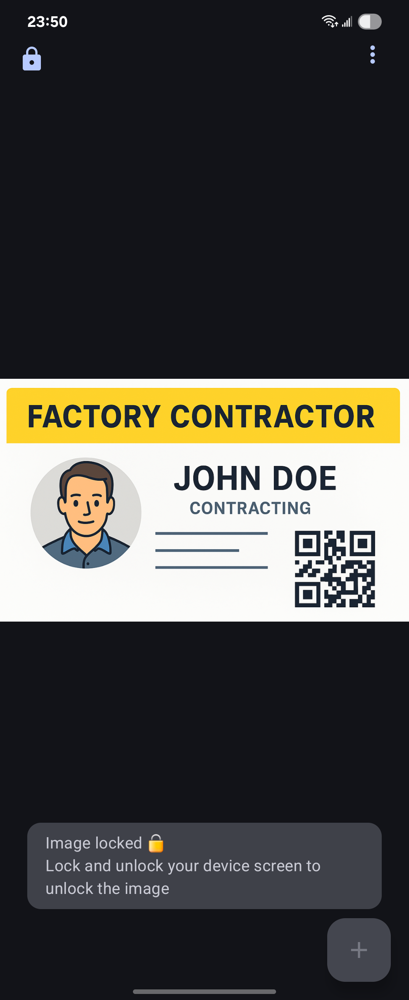
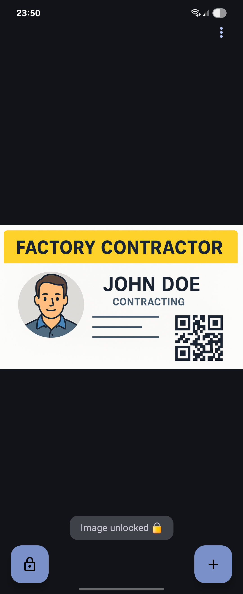

# LockView

[](https://www.android.com)
[](https://android-arsenal.com/api?level=24)
[](https://kotlinlang.org)
[](LICENSE)
[](https://play.google.com/store/apps/details?id=com.zac15987.lockview)
[](https://claude.ai/code)

An Android image viewer with lock functionality, gesture controls, and automatic device-unlock integration that prevents accidental interactions.

*Built in collaboration with [Claude Code](https://claude.ai/code)* 

## Motivation for Development

When entering a client's factory for work, a digital contractor ID (an image) is required for access. The process involves opening the contractor ID image, handing the phone to the security guard to scan the barcode on the image, and then having a security sticker applied to the phone's camera. During this procedure, the phone is often accidentally touched, sometimes nearly resulting in the deletion of the contractor ID image or the exposure of personal photos. These issues occur due to accidental gestures triggering the back function or pressing buttons unintentionally. This led to the decision to develop this application, which has successfully resolved this troublesome issue.

## Screenshots

<div align="center">
  <table>
    <tr>
      <td align="center">
        <br />
        <sub><b>Main Screen</b></sub>
      </td>
      <td align="center">
        <br />
        <sub><b>Image Selected</b></sub>
      </td>
      <td align="center">
        <br />
        <sub><b>Image Scaled</b></sub>
      </td>
      <td align="center">
        <br />
        <sub><b>Locked State</b></sub>
      </td>
    </tr>
    <tr>
      <td align="center">
        <br />
        <sub><b>Unlocked State</b></sub>
      </td>
      <td align="center">
        <br />
        <sub><b>Light Theme</b></sub>
      </td>
    </tr>
  </table>
</div>

## Features

### 🔒 Smart Lock System
- **Lock Protection**: Secure your images with a single tap - all gestures and interactions are disabled when locked
- **Auto-Unlock**: Automatically unlocks when you unlock your device
- **Persistent State**: Lock state is maintained across app restarts and screen rotations

### 🖼️ Advanced Image Viewer
- **Gesture Controls**: Intuitive pinch-to-zoom, pan, and double-tap zoom
- **Smart Boundaries**: Intelligent pan limits prevent images from moving off-screen
- **High Performance**: Smooth animations and responsive controls
- **Format Support**: Works with all common image formats (JPG, PNG, GIF, etc.)

### 🎨 Customization
- **Theme Options**: Choose between Light, Dark, or System theme
- **Dynamic Colors**: Material You support on Android 12+ for personalized theming
- **Multi-Language**: English and Traditional Chinese with instant language switching
- **No Restart Required**: Theme and language changes apply immediately

### 📱 Modern Android Design
- Built with Jetpack Compose and Material 3
- Follows Android best practices and architecture guidelines
- Optimized for Android 7.0 (API 24) through Android 15 (API 36)

## Installation

### From Google Play Store
[](https://play.google.com/store/apps/details?id=com.zac15987.lockview)

### From Source
1. Clone the repository:
   ```bash
   git clone https://github.com/zac15987/LockView.git
   cd LockView
   ```

2. Open the project in Android Studio

3. Build and run:
   - For Windows/WSL: `cmd.exe /c "gradlew installDebug"`
   - For Mac/Linux: `./gradlew installDebug`

### APK Installation
1. Download the latest APK from the [Releases](https://github.com/zac15987/LockView/releases) page
2. Enable "Install from Unknown Sources" in your device settings
3. Install the APK

## Usage

1. **Select an Image**: Tap the "Select Image" button to choose an image from your gallery
2. **Lock/Unlock**: Use the lock button to secure your image
3. **Zoom & Pan**: When unlocked, use pinch gestures to zoom and drag to pan
4. **Auto-Unlock**: Lock your device and unlock it - the image will automatically unlock
5. **Settings**: Access theme and language options from the menu

## Development

### Prerequisites
- Android Studio Ladybug or newer
- JDK 11 or higher
- Android SDK with API 36

### Architecture
- **UI Framework**: Jetpack Compose with Material 3
- **Architecture Pattern**: MVVM with Repository pattern
- **State Management**: StateFlow and Compose state
- **Dependency Injection**: Manual DI with ViewModel factories
- **Data Persistence**: DataStore Preferences

### Building
```bash
# Windows/WSL
cmd.exe /c "gradlew assembleDebug"     # Debug build
cmd.exe /c "gradlew assembleRelease"   # Release build

# Mac/Linux
./gradlew assembleDebug
./gradlew assembleRelease
```

### Signing Configuration

For release builds, you'll need to configure signing:

1. Copy `keystore.properties.template` to `keystore.properties`:
   ```bash
   cp keystore.properties.template keystore.properties
   ```

2. Edit `keystore.properties` with your signing information:
   ```properties
   storePassword=your_keystore_password
   keyPassword=your_key_password
   keyAlias=your_key_alias
   storeFile=path/to/your/keystore.keystore
   ```

3. Place your keystore file in the specified location

**Important**: Never commit `keystore.properties` or your `.keystore` files to version control. These files are already added to `.gitignore` for security.

### Testing
```bash
# Run all tests
cmd.exe /c "gradlew test"

# Run lint checks
cmd.exe /c "gradlew lint"
```

## Contributing

Contributions are welcome! Please feel free to submit a Pull Request.

1. Fork the repository
2. Create your feature branch (`git checkout -b feature/AmazingFeature`)
3. Commit your changes (`git commit -m 'Add some AmazingFeature'`)
4. Push to the branch (`git push origin feature/AmazingFeature`)
5. Open a Pull Request

## License

This project is licensed under the MIT License - see the [LICENSE](LICENSE) file for details.

## Acknowledgments

- Built with [Jetpack Compose](https://developer.android.com/jetpack/compose)
- Image loading by [Coil](https://coil-kt.github.io/coil/)
- Icons from [Material Design Icons](https://material.io/resources/icons/)

## Third-Party Libraries

This app uses the following open-source libraries:

### ImageViewer for Jetpack Compose
- **Author**: ZhangKe (0xZhangKe)
- **Repository**: [https://github.com/0xZhangKe/ImageViewer](https://github.com/0xZhangKe/ImageViewer)
- **License**: Apache License 2.0
- **Usage**: Gesture detection and zoom/pan functionality adapted for LockView's requirements

### Android Jetpack Libraries
- **AndroidX Core, Lifecycle, Activity Compose**
- **Jetpack Compose UI & Material 3**
- **DataStore Preferences**
- **License**: Apache License 2.0

### Additional Dependencies
- **Coil** - Image loading library ([Apache License 2.0](https://github.com/coil-kt/coil/blob/main/LICENSE.txt))
- **Accompanist Permissions** - Permission handling ([Apache License 2.0](https://github.com/google/accompanist/blob/main/LICENSE))

For detailed license information, see [docs/licenses/THIRD_PARTY_LICENSES.md](docs/licenses/THIRD_PARTY_LICENSES.md)

## Privacy

LockView respects your privacy:
- No data collection or analytics
- No network permissions required
- Images remain on your device
- No cloud storage or sharing features

## Support

For bug reports and feature requests, please [open an issue](https://github.com/zac15987/LockView/issues).